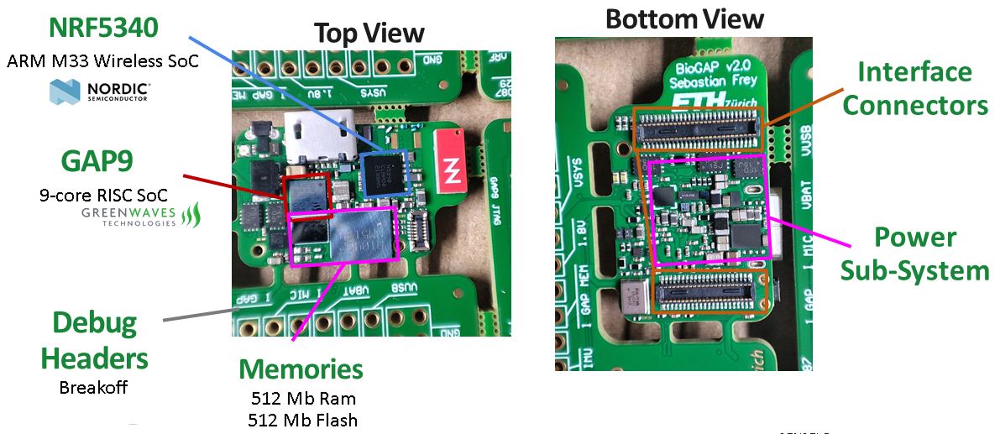

# SENSEI Base Board

This repository contains the hardware design files for the **SENSEI Base Board**, a flexible and ultra-low-power platform designed for edge AI and signal processing applications. The SENSEI Base Board enables modular integration of external sensors and specialized extension boards, making it an ideal foundation for multi-domain applications and long-term deployments in various monitoring use cases.

## Overview

The **SENSEI Base Board** is designed for advanced edge processing with a focus on low-power operation and flexibility. It incorporates key components such as **GAP9** and **NRF5340**, enabling multi-protocol connectivity and efficient near-sensor computation for advanced feature extraction and data compression. The board is also equipped with a variety of sensor interfaces and external connectors to support a wide range of use cases.

### Key Features
- **GAP9 SoC**:
  - 9-core RISC SoC with a fabric controller running up to 370 MHz.
  - 1536 kB L2 and 128 kB L1 on-chip memories.
  - Hardware acceleration via **NE16**.
  - External RAM (512Mbit) and Flash (512Mbit).
  
- **NRF5340 SoC**:
  - Multi-protocol Bluetooth Low Energy (BLE 5.4), IEEE 802.15.4, ANT, and 2.4GHz proprietary connectivity.
  - Dual-core Arm Cortex-M33 (128/64 MHz application processor and 64 MHz network processor).
  - 1 MB Flash and 512 KB RAM for the application processor, with external memory support.
  

## Changelog
A detailed changelog is available in the [Changelog.md](Changelog.md) file, which tracks all major updates and revisions to the board's design and documentation.

## Contributors
- **Sebastian Frey** ([sefrey@iis.ee.ethz.ch](mailto:sefrey@iis.ee.ethz.ch))
- **Philip Wiese** ([wiesep@iis.ee.ethz.ch](mailto:wiesep@iis.ee.ethz.ch))

## License
This repository makes use of the following licenses:
- for all *hardware*: Solderpad Hardware License Version 0.51
- for all *images*: Creative Commons Attribution 4.0 International
License][cc-by]

For further information have a look at the license files: `LICENSE.hw`, `LICENSE.images`